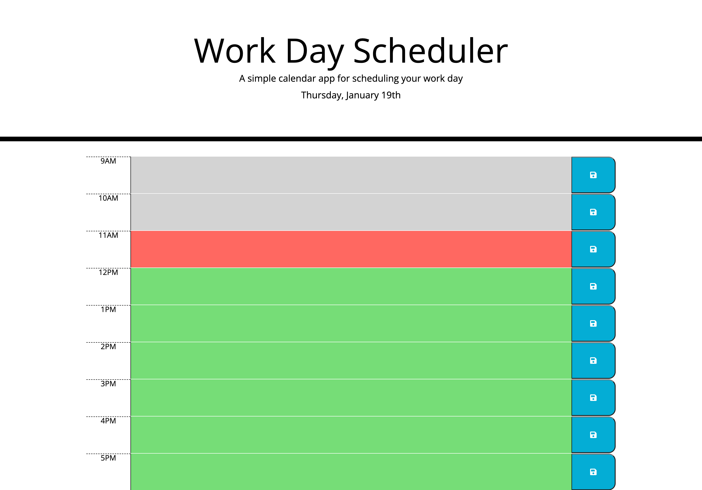

# Daily-Planner-App

## Description

This repository was created to make a Daily-Planner-App that allows the user to save events in the time blocks for standard business hours (9am - 5pm). The red colored time block indicates the current time, the grey colored time blocs are indicating past events and the green colored time blocks are indicating upcoming events.

## Usage

To use this app simply create/edit/delete event in one of the time blocks text area and to save it press blue button on the right side of the time block. if the event was successfully saved, you will see notification "Saved!" on top of the time blocks container.

## Link

https://1eva1987.github.io/Daily-Planner-App/

## License

MIT License
